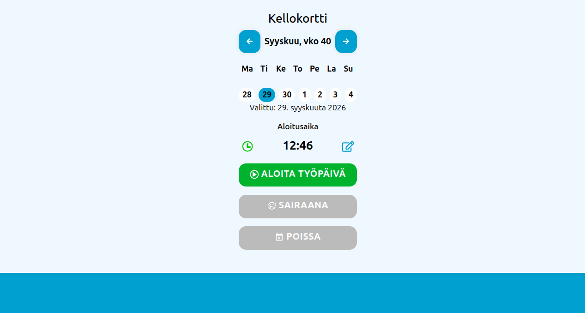
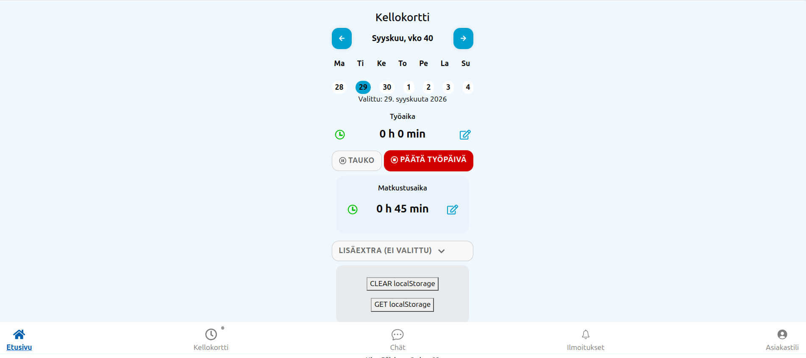

# ⏱️ Clock Timer Mini

Pieni ja yksinkertainen **työajan kirjaussovellus**, jolla voi seurata työskentelyyn käytettyä aikaa.

Projektin tarkoituksena on pitää työajan seuranta mahdollisimman selkeänä ja helppona ilman turhaa monimutkaisuutta. 🕐💻

## ✨ Ominaisuudet

* ⏱️ Työajan käynnistys ja pysäytys
* 🕐 Kuluneen ajan seuranta
* 📝 Työajan kirjaaminen
* 📊 Työajan tarkastelu
* 🔄 Yksinkertainen ja selkeä käyttöliittymä

## 🖼️ Kuvia

### ⏱️ Työajan seuranta

### 📋 Työajan kirjaus

## 🛠️ Teknologiat

* React
* JavaScript
* HTML
* CSS

## 🎯 Projektista

Clock Timer Mini on pieni harjoitusprojekti, jonka ideana on toteuttaa käytännöllinen työkalumainen web-sovellus.

Tavoitteena on ollut pitää sovellus **pienenä, selkeänä ja helposti ymmärrettävänä**.

---

⏱️ **Clock Timer Mini**
*Simple time tracking.*

## 📄 License

[LICENSE](./LICENSE)

CC0 1.0 Universal — free to use, modify, copy, and distribute, including for commercial purposes.

This project is released under the CC0 1.0 Universal public domain dedication.

CC0 1.0 Universal — Official License